# Unscented Kalman Filter Project Starter Code
Self-Driving Car Engineer Nanodegree Program

### Project Setup

1. mkdir build
2. cd build
3. cmake ..
4. make
5. ./UnscentedKF

##### Install Self Driving Car Simulator
https://github.com/udacity/self-driving-car-sim/releases/


##### Install uWebSocket
For Mac, run ```install-mac.sh```

For Ubuntu, run ```install-ubuntu.sh```

## Other Important Dependencies

* cmake >= 3.5
  * All OSes: [click here for installation instructions](https://cmake.org/install/)
* make >= 4.1 (Linux, Mac), 3.81 (Windows)
  * Linux: make is installed by default on most Linux distros
  * Mac: [install Xcode command line tools to get make](https://developer.apple.com/xcode/features/)
  * Windows: [Click here for installation instructions](http://gnuwin32.sourceforge.net/packages/make.htm)
* gcc/g++ >= 5.4
  * Linux: gcc / g++ is installed by default on most Linux distros
  * Mac: same deal as make - [install Xcode command line tools](https://developer.apple.com/xcode/features/)
  * Windows: recommend using [MinGW](http://www.mingw.org/)

## Basic Build Instructions

1. Clone this repo.
2. Make a build directory: `mkdir build && cd build`
3. Compile: `cmake .. && make` 
   * On windows, you may need to run: `cmake .. -G "Unix Makefiles" && make`
4. Run it: `./UnscentedKF `

# RMSE Result

|Lidar + Radar | Lidar    | Radar |
|-------------:|---------:|------:|
| X: 0.0973    | 0.1473   | 0.2302|
| Y: 0.0855    | 0.1153   | 0.3464|
|VX: 0.4513    | 0.6383   | 0.5835|
|VY: 0.4399    | 0.5346   | 0.8040|

By combine both Lidar and Radar measurement with Kalman Filter, we got better result.

[](https://youtu.be/0wFjfPko058)

[](https://youtu.be/lujr4PUlCWw)

[](https://youtu.be/mmXYubE_y70)


# How it works

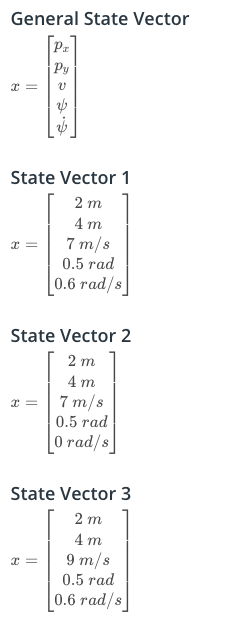

State_Vector_and_Examples


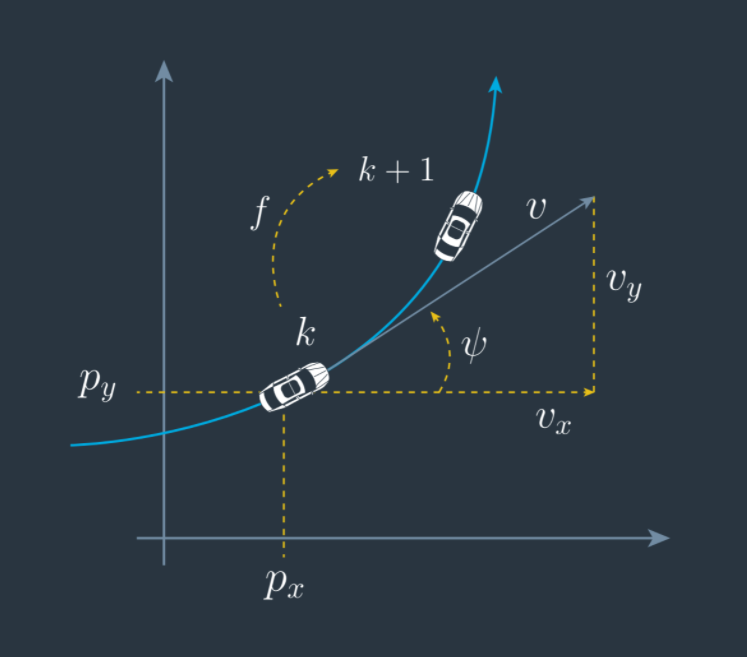

The CTRV Model

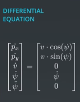

Differential_equation

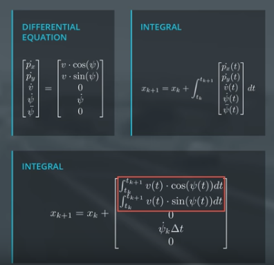

Delta_for_k+1


## When we go straight (Zero Yaw Rate)
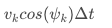

X_Position_When_Zero_Yaw_Rate


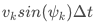

Y_Position_When_Zero_Yaw_Rate

## Noise

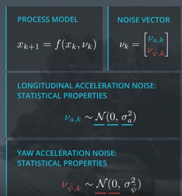

Process_Noise_Vector


## UKF Process

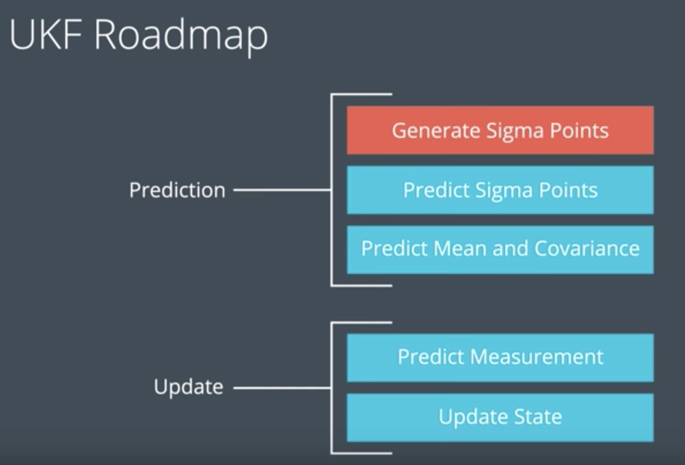

UKF_Process

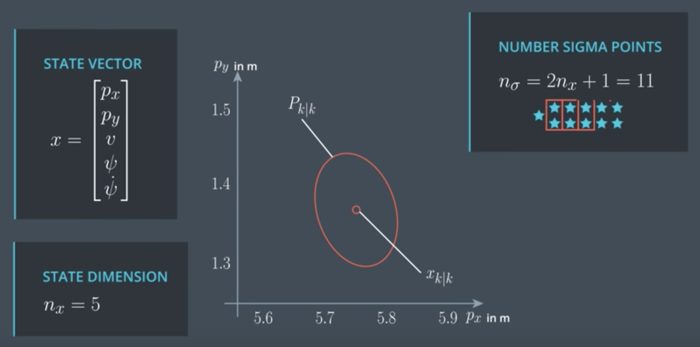

Number_of_Points_to_Generating, 2 * number_of_dimation + 1

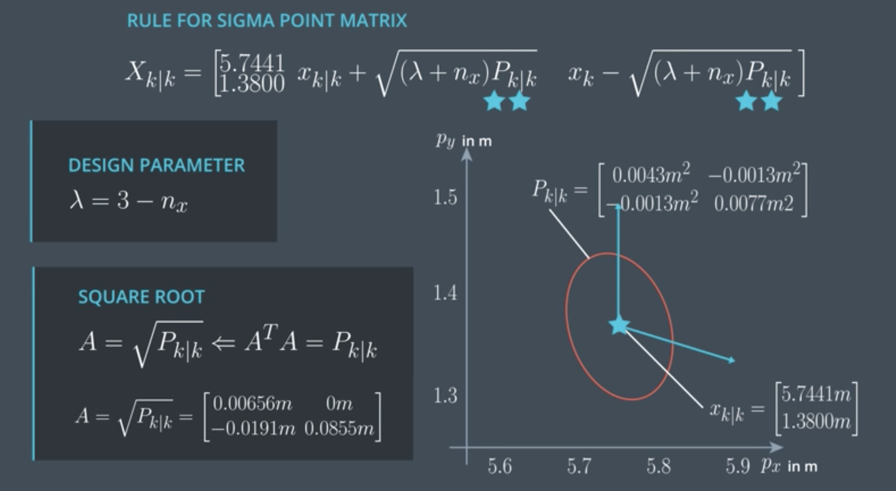

Generating_Sigma_Points

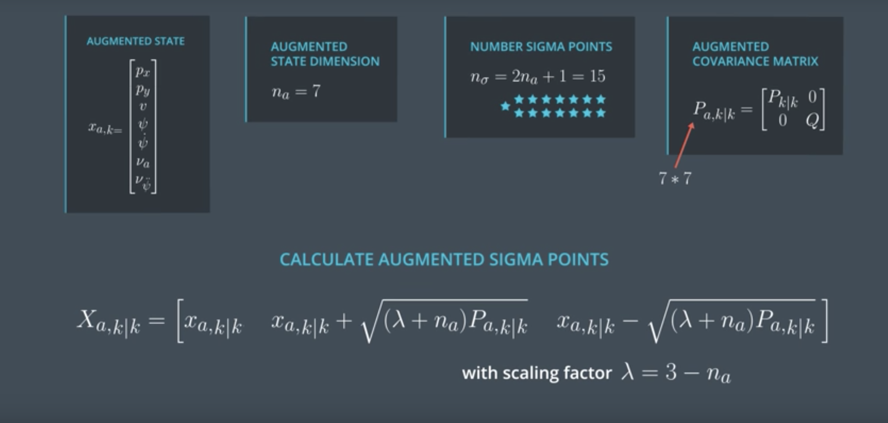

Generating_Sigma_Points_With_Noise


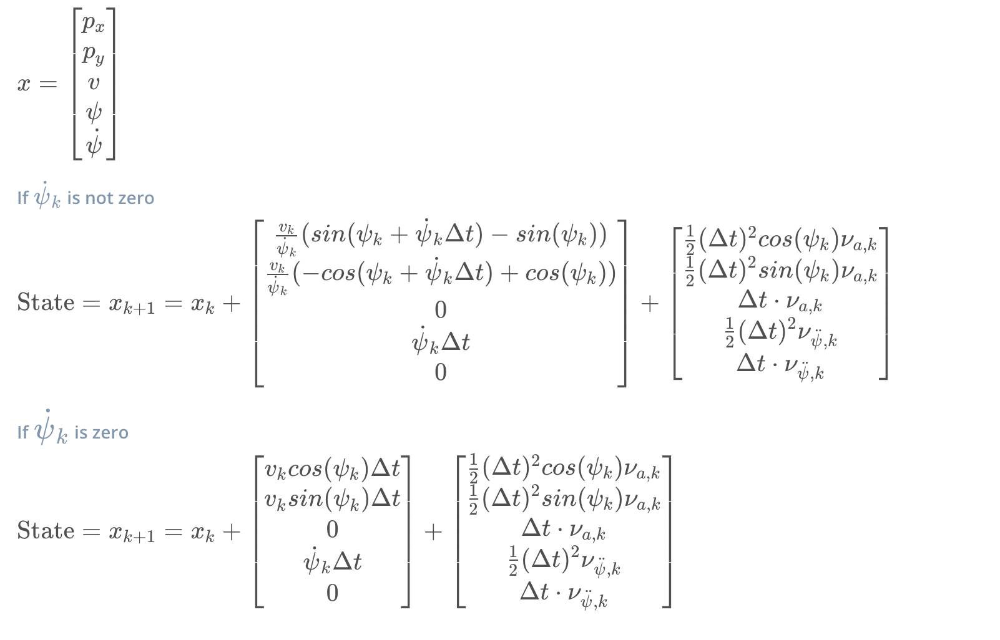

Sigma_Point_Prediction
